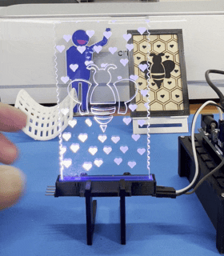
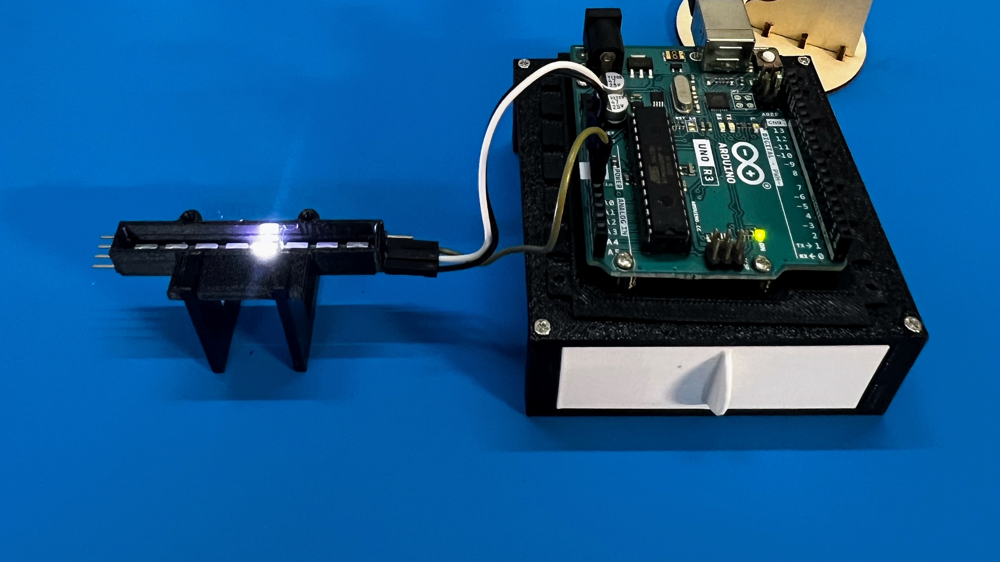
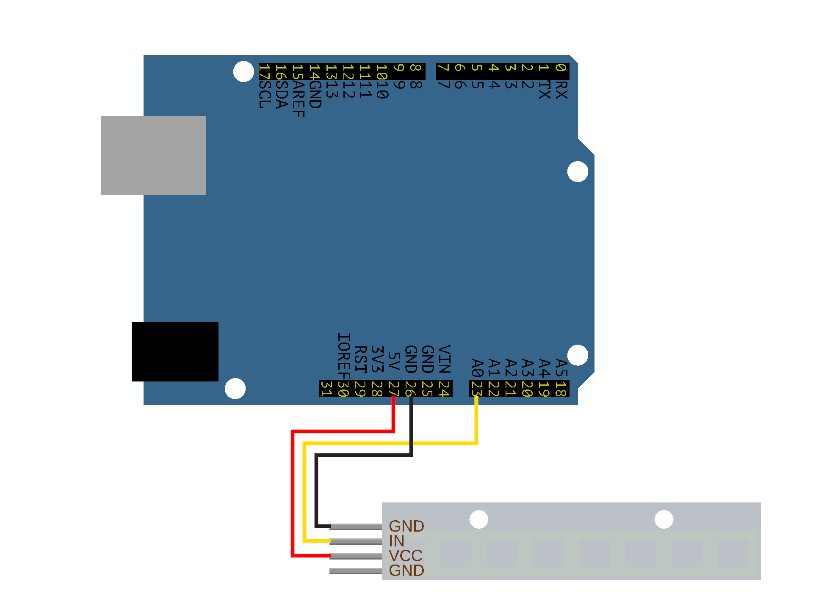

# simple-marquee
A simple NeoPixel test program using non-blocking timers.
This is a simple marquee program used to test a WS2812 LED module. It makes each LED light up in turn and loops continuously. The program does not use a "for" loop, but instead uses a "non-blocking timer" check to accumulate values, in order to avoid blocking the main loop.

# Installation
This is a PlatformIO project. Please refer to the [platformio.ini](https://github.com/study-gowin100/simple-marquee/blob/main/platformio.ini) file for details.

## Hardware
An Arduino UNO development board, an 8-LED WS2812 module, and some jumper wires.

### Connection
Use breadboard jumpers to connect the VCC of the WS2812 to the 5V of the Arduino, GND to GND, and DATA IN to A0 (PIN 14).

### Verification
Install the PLATFORMIO extension module in VS Code and open the project folder. Click Build or Upload on the toolbar.

## 3D Model files
Please refer to the [Printables](https://www.printables.com/@lab_GoWin100_4678432) project: [LED Acrylic LightScribing Module for Breadboard and Arduino Projects](https://www.printables.com/model/1676799-led-acrylic-lightscribing-module-for-breadboard-an).

# Credits
The project uses the [Adafruit NeoPixel Library](https://github.com/adafruit/adafruit_neopixel).

# License
The [original license of Adafruit NeoPixel Library](https://github.com/adafruit/adafruit_neopixel?tab=LGPL-3.0-1-ov-file).

# Demostration
Please watch the [YouTube video](https://www.youtube.com/watch?v=mbCUpNAOa5U).

